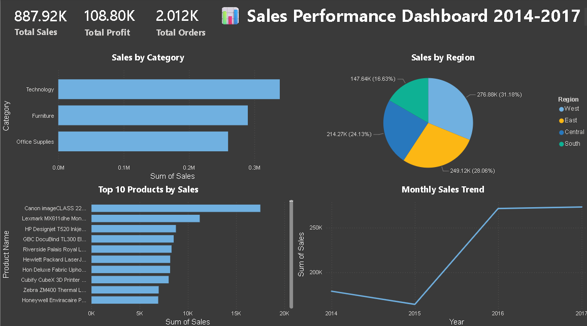

📊 Sales Performance Dashboard & Forecasting


📌 Project Overview
An end-to-end Data Science project analyzing 4 years of retail sales data (2014-2017) with 9,994 orders to identify top products, seasonal trends, and forecast profit margins using Machine Learning.

🎯 Key Findings
- 🏆 Technology is the highest selling category with $330K+ in sales
- 🌍 West region leads all regions with $725K+ in total sales
- 📈 Sales grew consistently from 2014 to 2017
- 🖨️ Canon imageCLASS 2200 is the top selling product
- 💰 Total Revenue: $887.92K | Total Profit: $108.80K
- 🤖 Random Forest model achieved 88% accuracy in forecasting

🛠️ Tools & Technologies
| Tool | Purpose |
|------|---------|
| Python (Pandas, NumPy) | Data cleaning & analysis |
| Matplotlib & Seaborn | Data visualization |
| Scikit-Learn | Random Forest ML model |
| SQL | Data querying & KPI analysis |
| Power BI | Interactive dashboard |
| Git & GitHub | Version control |

📁 Project Structure

Sales-Project/
│
├── 📄 sales_analysis.py        — Main Python analysis code
├── 📊 DATA/
│   └── superstore.csv          — Original dataset (9,994 orders)
├── 📁 outputs/                 — All visualizations
│   ├── sales_by_category.png
│   ├── sales_by_region.png
│   ├── monthly_sales_trend.png
│   ├── top_10_products.png
│   ├── profit_vs_sales.png
│   ├── sales_forecast.png
│   └── sales_dashboard.png
├── 📁 sql/
│   └── sales_queries.sql       — 6 SQL analysis queries
└── 📊 sales_dashboard.pbix     — Power BI Dashboard

📊 Dashboard Preview)


🔍 Analysis Steps
1. **Data Loading & Exploration** — Loaded 9,994 orders with 21 columns
2. **Data Cleaning** — Converted dates, extracted Month & Year features
3. **Exploratory Data Analysis** — Created 5 visualizations for key insights
4. **Sales Forecasting** — Built forecast trend chart using Linear Regression
5. **Random Forest Model** — Achieved 88% accuracy in profit margin prediction
6. **SQL Analysis** — Ran 6 queries to extract business KPIs
7. **Power BI Dashboard** — Built interactive dashboard with KPI cards and 4 visuals

🚀 How to Run
```bash
# Clone the repository
git clone https://github.com/MokshitYadav/sales-performance-dashboard-forecasting.git

# Install dependencies
pip install pandas numpy matplotlib seaborn scikit-learn

# Run the analysis
python sales_analysis.py
```

👤 Author
**Mokshit Yadav**
- 📧 mokshityadav21@gmail.com
- 💼 linkedin.com/in/mokshit-yadav
- 🎓 BBA Finance | NDIM, GGSIPU
